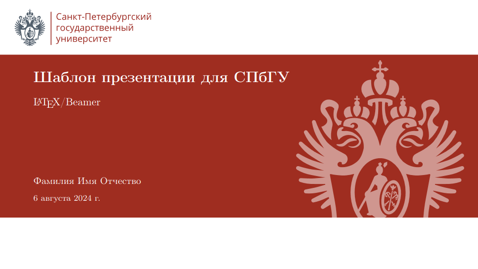
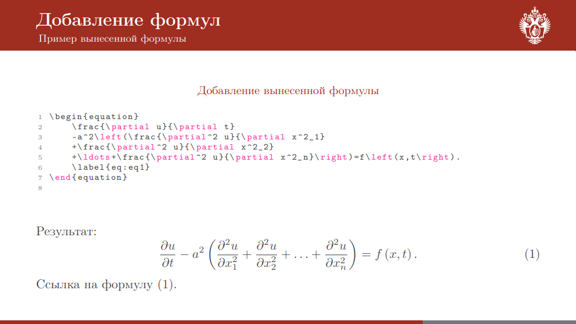
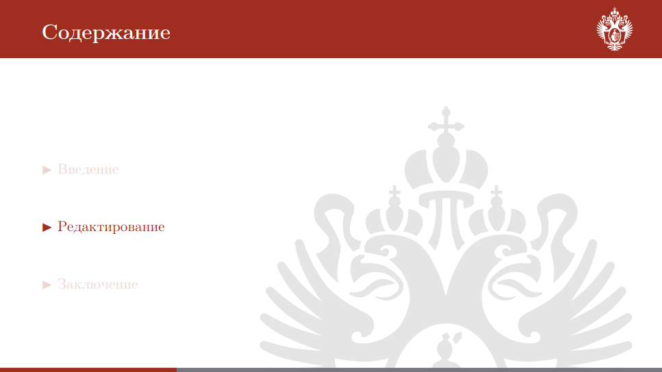

# SPbU-BeamerSlides

Этот проект представляет собой шаблон/пример презентации с использованием LaTeX и пакета Beamer.
Презентация стилизована под фирменный стиль Санкт-Петербургского государственного университета (СПбГУ).
Цвета и символика взяты с [официального сайта](https://pr.spbu.ru/design-templates).

## Структура проекта

### Основные файлы

- `presentation.tex`: основной файл со слайдами.
- `spbu.sty`: файл, содержащий настройку стилей и цветов.

### Директории

- `source/`: папка, содержащая изображения, используемые в презентации.
- `samples/`: папка с примерами.

## Использование

### Подготовка

Для работы с этим проектом вам потребуется установленный дистрибутив LaTeX. Рекомендуемые программы:

- **TeX Live** (Linux)
- **MiKTeX** (Windows)
- **MacTeX** (macOS)

### Компиляция

1. Убедитесь, что все необходимые пакеты установлены. Файл `spbu.sty` подключает следующие пакеты:
    - `tikz`
    - `xcolor`
    - `amsmath`
    - `amsfonts`
    - `verbatim`
    - `hyperref`
    - `listings`
    - `colortbl`

2. Скомпилируйте файл `presentation.tex` с использованием `pdflatex` или `xelatex`:

   ```bash
   pdflatex main.tex

## Примеры слайдов

<table>
     <tr>
          <td></td>
          <td></td>
     </tr>
     <tr>
          <td></td>
          <td></td>
     </tr>
</table>
